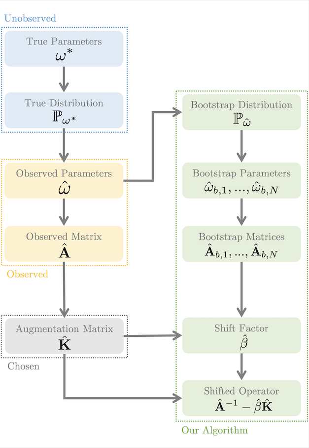
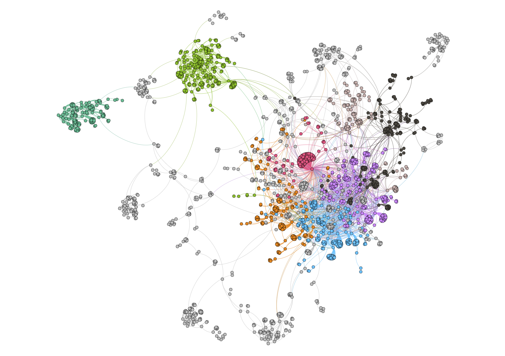

# Operator Shifting

This is a small testbed of problems for the operator shifting technique (formerly referred to as operator shifting). All the methods in our two papers **Operator Shifting for
Noisy Elliptic Systems** [(Preprint)](https://arxiv.org/abs/2010.09656) and **Operator Shifting for General Noisy Matrix Systems** [(Preprint)](https://arxiv.org/pdf/2104.11294.pdf) implemented herein.



# Dependencies

* The **Eigen** linear algebra library. [Available Here](https://gitlab.com/libeigen/eigen).
* The **LEMON** graph library. [Available Here](https://lemon.cs.elte.hu/trac/lemon/wiki/Downloads).
* **cmake** for building.

# Configuration

To update the configuration, please see config.json, make sure that config.json is in the same directory as your binary. The application will load all of its configuration from the config.json. cmake will copy the config.json to the output directory by default. 

We provide four examples of how operator shifting may be used to improve accuracy when solving noisy elliptic systems, and one example for solving noisy general linear systems. These testbeds are:

* **GridLaplacian1D**: (Elliptic) A 1D grid Laplacian system corrupted by noise. The source for this testbed can be found in **tests/gridLaplacian1D**.
    * This testbed has the following configuration properties:
        * **gridSize**: Number of vertices of the grid graph.
        * **stdDev**: The standard deviation of the random variable used to perturb the edge weights. (See paper for details)
        * **distribution**: Specifies the distribution of the random variable used to perturb the edge weights. Can be either *discrete* or *gamma*. (See paper for details)
* **GridLaplacian2D**: (Elliptic) A 2D grid Laplacian system corrupted by noise. The source for this testbed can be found in **tests/gridLaplacian2D**.
    * This testbed has the following configuration properties:
        * **gridSize**: Number of vertices of the grid graph.
        * **stdDev**: The standard deviation of the random variable used to perturb the edge weights. (See paper for details)
        * **distribution**: Specifies the distribution of the random variable used to perturb the edge weights. Can be either *discrete* or *gamma*. (See paper for details)
* **GraphEdgePerturb**: (Elliptic) A Laplacian system on a graph where the edge weights have been corrupted by noise. The source for this testbed can be found in **tests/graphEdgePerturb**.
    * This testbed has the following configuration properties:
        * **stdDev**: The standard deviation of the random variable used to perturb the edge weights. (See paper for details)
        * **distribution**: Specifies the distribution of the random variable used to perturb the edge weights. Can be either *discrete* or *gamma*. (See paper for details)
        * **graphSrc** : The edge list of the graph to run the test on.
        * **format** : Whether the edge list above is in *unweighted* or *weighted* format. If the format is *unweighted*, weights for the graph will randomly be generated.
        * **boundary**: Specifies a list of node IDs to be set as the boundary of the Laplacian system. (See paper for details)
* **GraphEdgeDrop**: (Elliptic) A Laplacian system on a graph where some of the edges have been deleted from the graph. The source for this testbed can be found in **tests/graphEdgeDrop**.
    * This testbed has the following configuration properties:
        * **graphSrc** : The edge list of the graph to run the test on.
        * **format** : Whether the edge list above is in *unweighted* or *weighted* format. If the format is *unweighted*, weights for the graph will randomly be generated.
        * **boundary**: Specifies a list of node IDs to be set as the boundary of the Laplacian system. (See paper for details)
* **AsymMarkov**: (Non-elliptic) A selection of value function estimation problems, where the underlying Markov chain is subject to sampling noise. The source for this testbed can be found in **tests/asymMarkov**.
    * This testbed has the following configuration properties:
        * **preset**: Determines the properties of the underlying Markov chain. The current presents are:
          *  **0**: *(P1D_1d4_1d4)* A 1D Markov chain on a grid with a 1/4 probability of moving right and a 1/4 probability of moving left each iteration.
          * **1**: *(P1D_1d6_2d6)* Like the above, but with a 2/6 probability of right and 1/6 probability of left.
          * **2**: *(P1D_0_1d2)* Like the above, but with a 1/2 probability of right and 0 probability of left.
          * **3**: *(P1D_1d8_1d8_1d8_1d8)* A 1D Markov chain on a grid with 1/8 probability of moving 2 spaces left, 1/8 probability of moving 2 spaces right, and 1/8 probability of moving 1 space left/right respectively.
          * **4**: *(P1D_complete)* A Markov chain on the complete graph.
          * **5**: *(P2D_unif)* A Markov chain on the 2D grid with equal probabilities of moving to any adjacent vertex.
          * **6**: *(P2D_nonunif)* A Markov chain on the 2D grid with probabilities that vary based on the location in the grid.
          * **7**: *(P3D_unif)* Like the above, but for 3D.
          * **8**: *(P3D_nonunif)* Like the above, but for 3D.
        * **histogramSamples**: The number of samples to take for each row of the probability transition matrix.
        * **gridSize** : The size of the Markov chain.
        * **discountFactor** : The discount factor to use when computing the value function.
* The following configuration properties are shared by all testbeds:
    * **threadCount**: The number of threads to use for the computation.
    * **numSubRunsNaive**: The number of Monte Carlo samples to use for determining the error of the naive method.
    * **numSubRuns**: The number of Monte Carlo samples to use for determining the error of the shifting methods.
    * **samplesPerSubRun**: For each Monte Carlo sample used to determine the error of the shifting methods, we must compute a shift factor. This is the number of samples that is used to compute the shift factor.

The configuration of each of these examples is stored in the relevant section of *config.json*.

# Running the Examples

We have tested these examples on Linux with GCC. Other platforms may work but are not necessarily supported. Use cmake to generate Makefiles and then call make to compile.

The build should output binaries for all tests to the build directory, from which you can run the corresponding test.

# Code Structure and Usage

At a high level, the code is split into two parts:

* **Operator Shifting**: The actual code that implements the methods we present in our paper is in **opshift.cpp** and **opshift.h**.
* **Diagnostics**: These are helper functions to accelerate the process of testing the operator shifting framework on new examples. These are implemented in **diagnostics.cpp** and **diagnostics.h**.

## Operator Shifting Interface

Here we detail the interface that the shifting algorithms in **opshift.cpp** expose to the end user.

### Interfaces for Matrices and Distributions

The setting of operator shifting requires the user to specify a parameterized matrix distribution. In the code, this is done by inheriting from the **IMatrixDistribution** interface:

```cpp
class IMatrixDistribution
{
public:
    virtual void drawSample(std::shared_ptr<IInvertibleMatrixOperator>* Ahat) const = 0;
};
```

For a noisy elliptic system of the form **Ax = b**, you only need to override the **drawSample** method to provide a sample of **A** from a bootstrapped matrix distribution estimated from data.

The matrix **A** is represented by the **IInvertibleMatrixOperator** interface, which has the form

```cpp
class IMatrixOperator
{
public:
    virtual void apply(const Eigen::VectorXd& b, Eigen::VectorXd* result) const = 0;
    virtual bool isIdentity() const = 0;
};

class IInvertibleMatrixOperator : public IMatrixOperator
{
public:
    virtual void preprocess() = 0;
    virtual void solve(const Eigen::VectorXd& b, Eigen::VectorXd* result) const = 0;
};
```

* You must override the **apply** method to apply the operator **A** to the vector **b** and store the result in **result**.
* The **isIdentity** method should return **true** if **A** is the identity and **false** otherwise.
* The **preprocess** method will be called once, and you should use it to pre-factorize the operator so that it can be efficiently applied later.
* The **solve** method applies the inverse of **A** to the vector **b** and stores the result in **result**.

Finally, there are also the **IVectorDistribution** **IVectorPairDistribution** interface. These interfaces are used for drawing vectors to efficiently compute operator traces via Monte Carlo as described in the paper. Standard operator shifting uses the **IVectorPairDistribution** interface, as in the paper, it requires random vector samples **q** for the numerator of the shifting factor and **u** for the denominator. Our other shifting methods only require random vector samples **q** and therefore use the **IVectorDistribution** interface instead of the **IVectorPairDistribution** interface.

```cpp
class IVectorDistribution
{
public:
    virtual void drawSample(Eigen::VectorXd* v) const = 0;
};

class IVectorPairDistribution
{
public:
    virtual bool areEqual() const = 0;
    virtual void drawSample(Eigen::VectorXd* v1, Eigen::VectorXd* v2) const = 0;
};
```

Note that in some cases, for **IVectorPairDistribution**, the samples for **q** and **u** may be the same. In this case, to avoid additional unnecessary computation, one should override the **areEqual** property to **true**, and otherwise, it should be **false**.

## General Operator Shifting (GS; Elliptic)

The first method we support is general operator shifting, as described in algorithm (5.1) of our paper.

```cpp
void opshift(
    int num_system_samples,
    int num_per_system_samples,
    const Eigen::VectorXd &rhs,
    IInvertibleMatrixOperator *op_Ahat,
    const IMatrixDistribution *bootstrap_mat_dist,
    Eigen::VectorXd *output);
```

```cpp
void opshift(
    int num_system_samples,
    int num_per_system_samples,
    const Eigen::VectorXd& rhs,
    IInvertibleMatrixOperator* op_Ahat,
    const IMatrixDistribution* bootstrap_mat_dist,
    const IVectorPairDistribution* q_u_dist,
    const IMatrixOperator* op_R,
    const IMatrixOperator* op_B,
    Eigen::VectorXd* output);
```

These functions take the following parameters:

* **num_system_samples**: The number of Monte Carlo samples to use to compute the shift factor.
* **num_per_system_samples**: All of the system samples above require a matrix inversion. However, we can reduce sampling error by sharing inverses across multiple samples (i.e., the number of samples *per system*). This parameter specifies the number of times a matrix inverse is reused across samples. Note that doing this still gives a consistent estimator of the shift factor.
* **rhs**: The right hand side **b** of the noisy elliptic system **Ax = b**.
* **op_Ahat**: The operator **A** observed from data.
* **bootstrap_mat_dist**: A bootstrapped distribution for the random matrix **A**.
* **q_u_dist**: A joint distribution for drawing samples of the random vectors **q** and **u** as described in algorithm (5.1). This distribution depends on the choice of **R** and **B**. If **R** and **B** are the identity, then the default is just to sample from a standard multivariate normal distribution.
* **op_R**: The operator **R** as described in algorithm (5.1). Defaults to the identity.
* **op_B**: The operator **B** as described in algorithm (5.1). Defaults to the identity.
* **output**: A pointer to where the estimate of the vector **x** should be written to.

## Energy Operator Shifting (ES; Elliptic)

This method performs operator shifting in the energy norm as described in section (6) and meta-algorithm (7.1). The polynomial expression for the shifting factor is not truncated.

```cpp
void energyOpshift(
    int num_system_samples,
    int num_per_system_samples,
    const Eigen::VectorXd &rhs,
    IInvertibleMatrixOperator *op_Ahat,
    const IMatrixDistribution *bootstrap_mat_dist,
    Eigen::VectorXd *output);
```

```cpp
void energyOpshift(
    int num_system_samples,
    int num_per_system_samples,
    const Eigen::VectorXd &rhs,
    IInvertibleMatrixOperator *op_Ahat,
    const IMatrixDistribution *bootstrap_mat_dist,
    const IVectorDistribution *q_dist,
    const IMatrixOperator *op_C,
    Eigen::VectorXd *output);
```

These functions take the following parameters:

* **num_system_samples**: The number of Monte Carlo samples to use to compute the shift factor.
* **num_per_system_samples**: All of the system samples above require a matrix inversion. However, we can reduce sampling error by sharing inverses across multiple samples (i.e., the number of samples *per system*). This parameter specifies the number of times a matrix inverse is reused across samples. Note that doing this still gives a consistent estimator of the shift factor.
* **rhs**: The right hand side **b** of the noisy elliptic system **Ax = b**.
* **op_Ahat**: The operator **A** observed from data.
* **bootstrap_mat_dist**: A bootstrapped distribution for the random matrix **A**.
* **q_dist**: A distribution for drawing samples of the random vectors **q** as described in algorithm (7.1). This distribution depends on the choice of **C**. If **C**  is the identity, then the default is just to sample from a standard multivariate normal distribution.
* **op_C**: The operator **C** as described in algorithm (7.1). Defaults to the identity.
* **output**: A pointer to where the estimate of the vector **x** should be written to.

## Truncated Energy Operator Shifting (ES-T; Elliptic)

This method performs operator shifting in the energy norm as described in section (7) and meta-algorithm (7.1). The polynomial expression for the shift factor is truncated to the specified order and with the specified windowing function.

```cpp
void energyOpshiftTruncated(
    int num_system_samples,
    int num_per_system_samples,
    const Eigen::VectorXd &rhs,
    int order,
    IInvertibleMatrixOperator *op_Ahat,
    const IMatrixDistribution *bootstrap_mat_dist,
    Eigen::VectorXd *output);
```
```cpp
void energyOpshiftTruncated(
    int num_system_samples,
    int num_per_system_samples,
    const Eigen::VectorXd &rhs,
    int order,
    IInvertibleMatrixOperator *op_Ahat,
    const IMatrixDistribution *bootstrap_mat_dist,
    const IVectorDistribution *q_dist,
    const IMatrixOperator *op_C,
    Eigen::VectorXd *output);
```

```cpp
void energyOpshiftTruncated(
    int num_system_samples,
    int num_per_system_samples,
    const Eigen::VectorXd &rhs,
    int order,
    IInvertibleMatrixOperator *op_Ahat,
    const IMatrixDistribution *bootstrap_mat_dist,
    std::function<double(int, int)> &window_func_numerator,
    std::function<double(int, int)> &window_func_denominator,
    Eigen::VectorXd *output);
```

```cpp
void energyOpshiftTruncated(
    int num_system_samples,
    int num_per_system_samples,
    const Eigen::VectorXd &rhs,
    int order,
    IInvertibleMatrixOperator *op_Ahat,
    const IMatrixDistribution *bootstrap_mat_dist,
    const IVectorDistribution *q_dist,
    const IMatrixOperator *op_C,
    std::function<double(int, int)> &window_func_numerator,
    std::function<double(int, int)> &window_func_denominator,
    Eigen::VectorXd *output);
```

* **num_system_samples**: The number of Monte Carlo samples to use to compute the shift factor.
* **num_per_system_samples**: All of the system samples above require a matrix inversion. However, we can reduce sampling error by sharing inverses across multiple samples (i.e., the number of samples *per system*). This parameter specifies the number of times a matrix inverse is reused across samples. Note that doing this still gives a consistent estimator of the shift factor.
* **rhs**: The right hand side **b** of the noisy elliptic system **Ax = b**.
* **order**: The order of the truncation.
* **op_Ahat**: The operator **A** observed from data.
* **bootstrap_mat_dist**: A bootstrapped distribution for the random matrix **A**.
* **q_dist**: A distribution for drawing samples of the random vectors **q** as described in algorithm (7.1). This distribution depends on the choice of **C**. If **C**  is the identity, then the default is just to sample from a standard multivariate normal distribution.
* **op_C**: The operator **C** as described in algorithm (7.1). Defaults to the identity.
* **window_func_numerator**: The windowing function to use for the numerator of the truncated shift factor expression. You may use **softWindowFuncNumerator** or **hardWindowFuncNumerator** for the soft/hard windowing functions presented respectively. Defaults to soft windowing function.
* **window_func_denominator**: The windowing function to use for the denominator of the truncated shift factor expression. You may use **softWindowFuncDenominator** or **hardWindowFuncDenominator** for the soft/hard windowing functions presented respectively. Defaults to soft windowing function.
* **output**: A pointer to where the estimate of the vector **x** should be written to.

## Truncated Rebased Accelerated Energy Operator Shifting (ES-TRA; Elliptic)

This method performs an accelerated version of truncated operator shifting with a shifted base-point, as described in algorithm (9.1)

```cpp
double energyShiftFactorTruncatedRebasedAccel(
    int num_system_samples,
    int num_per_system_samples,
    int dimension,
    int order,
    double eps,
    IInvertibleMatrixOperator* op_Ahat,
    const IMatrixDistribution* bootstrap_mat_dist,
    const IVectorDistribution* q_dist,
    std::function<double(int, int, double)>& window_func_numerator,
    std::function<double(int, int, double)>& window_func_denominator);
```

```cpp
void energyOpshiftTruncatedRebasedAccel(
    int num_system_samples,
    int num_per_system_samples,
    const Eigen::VectorXd& rhs,
    int order,
    double eps,
    IInvertibleMatrixOperator* op_Ahat,
    const IMatrixDistribution* bootstrap_mat_dist,
    const IVectorDistribution* q_dist,
    const IMatrixOperator* op_C,
    std::function<double(int, int, double)>& window_func_numerator,
    std::function<double(int, int, double)>& window_func_denominator,
    Eigen::VectorXd* output);
```

```cpp
void energyOpshiftTruncatedRebasedAccel(
    int num_system_samples,
    int num_per_system_samples,
    const Eigen::VectorXd& rhs,
    int order,
    double eps,
    IInvertibleMatrixOperator* op_Ahat,
    const IMatrixDistribution* bootstrap_mat_dist,
    const IVectorDistribution* q_dist,
    const IMatrixOperator* op_C,
    Eigen::VectorXd* output);
```

```cpp
void energyOpshiftTruncatedRebasedAccel(
    int num_system_samples,
    int num_per_system_samples,
    const Eigen::VectorXd& rhs,
    int order,
    double eps,
    IInvertibleMatrixOperator* op_Ahat,
    const IMatrixDistribution* bootstrap_mat_dist,
    Eigen::VectorXd* output);
```

```cpp
void energyOpshiftTruncatedRebasedAccel(
    int num_system_samples,
    int num_per_system_samples,
    const Eigen::VectorXd& rhs,
    int order,
    double eps,
    IInvertibleMatrixOperator* op_Ahat,
    const IMatrixDistribution* bootstrap_mat_dist,
    std::function<double(int, int, double)>& window_func_numerator,
    std::function<double(int, int, double)>& window_func_denominator,
    Eigen::VectorXd* output);
```

* **num_system_samples**: The number of Monte Carlo samples to use to compute the shift factor.
* **num_per_system_samples**: All of the system samples above require a matrix inversion. However, we can reduce sampling error by sharing inverses across multiple samples (i.e., the number of samples *per system*). This parameter specifies the number of times a matrix inverse is reused across samples. Note that doing this still gives a consistent estimator of the shift factor.
* **rhs**: The right hand side **b** of the noisy elliptic system **Ax = b**.
* **eps**: Stops the power method computation when the result changes by less than a factor of **eps**.
* **order**: The order of the truncation.
* **op_Ahat**: The operator **A** observed from data.
* **bootstrap_mat_dist**: A bootstrapped distribution for the random matrix **A**.
* **q_dist**: A distribution for drawing samples of the random vectors **q** as described in algorithm (7.1). This distribution depends on the choice of **C**. If **C**  is the identity, then the default is just to sample from a standard multivariate normal distribution.
* **op_C**: The operator **C** as described in algorithm (7.1). Defaults to the identity.
* **window_func_numerator**: The windowing function to use for the numerator of the truncated shift factor expression. You may use **softWindowFuncNumerator** or **hardWindowFuncNumerator** for the soft/hard windowing functions presented respectively. Defaults to soft windowing function.
* **window_func_denominator**: The windowing function to use for the denominator of the truncated shift factor expression. You may use **softWindowFuncDenominator** or **hardWindowFuncDenominator** for the soft/hard windowing functions presented respectively. Defaults to soft windowing function.
* **output**: A pointer to where the estimate of the vector **x** should be written to.

## Residual Operator Shifting (RS; Non-Elliptic)

This algorithm is an implementation of our operator shifting method from our non-elliptic paper. 

```cpp
void residualOpshift(
    int num_system_samples,
    int num_per_system_samples,
    const Eigen::VectorXd& rhs,
    IInvertibleMatrixOperator* op_Ahat,
    const IMatrixDistribution* bootstrap_mat_dist,
    Eigen::VectorXd* output);
```

```cpp
void residualOpshift(
    int num_system_samples,
    int num_per_system_samples,
    const Eigen::VectorXd& rhs,
    IInvertibleMatrixOperator* op_Ahat,
    const IMatrixDistribution* bootstrap_mat_dist,
    const IVectorDistribution* q_dist,
    const IInvertibleMatrixOperator* op_R,
    Eigen::VectorXd* output);
```

* **num_system_samples**: The number of Monte Carlo samples to use to compute the shift factor.
* **num_per_system_samples**: All of the system samples above require a matrix inversion. However, we can reduce sampling error by sharing inverses across multiple samples (i.e., the number of samples *per system*). This parameter specifies the number of times a matrix inverse is reused across samples. Note that doing this still gives a consistent estimator of the shift factor.
* **rhs**: The right hand side **b** of the noisy elliptic system **Ax = b**.
* **bootstrap_mat_dist**: A bootstrapped distribution for the random matrix **A**.
* **q_dist**: A distribution for drawing samples of the random vectors **q** as described in section 8 of our non-elliptic paper. The second moment of **q** should be **R^-1**. If **R** is not specified, then the default is just to sample from a standard multivariate normal distribution.
* **op_R**: The operator **R**.
* **output**: A pointer to where the estimate of the vector **x** should be written to.

## Truncated Residual Operator Shifting (RS-T; Non-Elliptic)

Just like the above, except uses a Taylor approximation when computing Monte Carlo samples.

```cpp
void residualOpshiftTruncated(
    int num_system_samples,
    int num_per_system_samples,
    const Eigen::VectorXd& rhs,
    int order,
    IInvertibleMatrixOperator* op_Ahat,
    const IMatrixDistribution* bootstrap_mat_dist,
    const IVectorDistribution* q_dist,
    const IInvertibleMatrixOperator* op_R,
    Eigen::VectorXd* output);
```

```cpp
void residualOpshiftTruncated(
    int num_system_samples,
    int num_per_system_samples,
    const Eigen::VectorXd& rhs,
    int order,
    IInvertibleMatrixOperator* op_Ahat,
    const IMatrixDistribution* bootstrap_mat_dist,
    Eigen::VectorXd* output);
```

* **order**: The order of the Taylor expansion. Currently only second order is supported.

# The Diagnostics Framework

We also provide a framework for testing the effectiveness of our methods in the files **diagnostics.cpp** and **diagnostics.h**. This diagnostics framework can be used to replicate our results as well as easily test the operator shifting method on new problems.

## The Problem Interface

Noisy elliptic system problems are defined by using the **ProblemDefinition** class.

```cpp
template<typename ParameterType, typename HyperparameterType>
class ProblemDefinition {
    [...]
};
```

Problem definitions have two template parameters:

* **ParameterType**: This defines the data structure used to parameterize a distribution over elliptic matrices. When a bootstrapped distribution for **A** is formed, these parameters are bootstrapped, (i.e., we use the observed values of these parameters to form a bootstrapped distribution for **A**). For example, in Laplacian problems, these parameters might include the true edge weights of the graph before they are perturbed by noise.
* **HyperparameterType**: This define a data structure of parameters that do not need to be bootstrapped, but rather are known a priori. For example, these parameters might include the magnitude or standard deviation of the noise in the problem.

We assume that there is a well-defined map from a parameter value to the noisy operator **A**. So for example, in a Laplacian system, if the edge weights are known, then there is a well-defined way to construct the Laplacian.

The problem definition takes in its constructor a pointer to a matrix parameter distribution,

```cpp
template<typename ParameterType, typename HyperparameterType>
class MatrixParameterDistribution : public IMatrixDistribution {
    [...]
};
```
This class represents a distribution over parameters that itself is characterized by a (parameter, hyperparameter) pair. This allows us to bootstrap a distribution from an observed parameter value sampled from the true distribution. To define a problem, you must implement a distribution class that inherits from this type and implements the methods:

```cpp
virtual void drawParameters(ParameterType *output) const = 0;

virtual std::shared_ptr<IInvertibleMatrixOperator> convert(
    const ParameterType  params) const = 0;

virtual size_t getDimension() const = 0;
```

* **drawParameters** samples a parameter value from the distribution.
* **convert** converts a parameter value to a matrix.
* **getDimension** gets the dimension of all matrices that will be produced by this distribution.

Once your implementation of **MatrixParameterDistribution** is complete, you can create a **ProblemDefinition** instance from it, and pass that **ProblemDefinition** to our **Diagnostics** class. For example,

```cpp
auto parameters = ParameterType();
auto hyperparameters = HyperparameterType();

// [...] Init Parameters and hyperparameters

auto true_distribution = std::shared_ptr<ParameterDistributionType>(
    new ParameterDistributionType(parameters, hyperparameters));

auto problem_def = std::shared_ptr<
    ProblemDefinition<ParameterType, HyperparameterType>>(
        new ProblemDefinition<ParameterType, HyperparameterType>>(
            true_distribution));

auto diagnostics = Diagnostics<ParameterType, HyperparameterType>(problem_def);
```

Afterwards, you can specify which of our methods you would like to test by passing a list of **ProblemRun** instances to the **Diagnostics** class. For example, to test the GS method, use:

```cpp
run = std::shared_ptr<
    ProblemRun<ParameterType, HyperparameterType>>(
        new OpshiftRun<ParameterType, HyperparameterType>(
            problem_def.get());

run->numberSubRuns = numSubRuns;
run->samplesPerSubRun = samplesPerSubRun;
diagnostics.addRun(run);

diagnostics.run(threadCount);
```
You can then print the results with:
```cpp
diagnostics.printResults();
```
or create a LaTeX table of the results with:
```cpp
diagnostics.printLatexTable();
```

All of the provided testbeds are implemented using this framework, so see the source code for more guidance.

# Graph Laplacians

We include the two graphs that we used in our paper for the graph Laplacian examples. They are located in **Graphs/**. These graphs were taken from the [Network Repository](http://networkrepository.com). Below is a rendering of the **fb-pages-food** graph:

