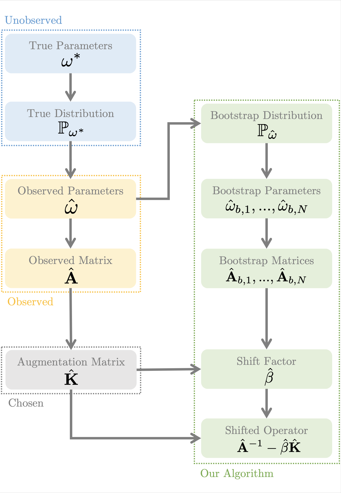

# C++ Operator Augmentation

This is a small testbed of problem for operator augmentation. All the methods in our paper [Operator Augmentation for
Noisy Elliptic Systems](https://arxiv.org/abs/2010.09656) are implemented herein.



## Prerequisites

This testbed requires the Eigen linear algebra library, as well as the LEMON graph library.
To build the test bed you will need CMake.

# Configuration

To update the configuration, please see config.json, make sure that config.json is in the same directory as your binary. The application will load all of its configuration from the config.json.

We provide four examples of how operator augmentation may be used to improve accuracy when solving noisy elliptic systems. These testbeds are:

* **GridLaplacian1D**: A 1D grid Laplacian system corrupted by noise. The source for this testbed can be found in **dgnGridLaplacian1D.cpp**.
    * This testbed has the following configuration properties:
        * **gridSize**: Number of vertices of the grid graph.
        * **stdDev**: The standard deviation of the random variable used to perturb the edge weights. (See paper for details)
        * **distribution**: Specifies the distribution of the random variable used to perturb the edge weights. Can be either *discrete* or *gamma*. (See paper for details)
* **GridLaplacian2D**: A 2D grid Laplacian system corrupted by noise. The source for this testbed can be found in **dgnGridLaplacian2D.cpp**.
    * This testbed has the following configuration properties:
        * **gridSize**: Number of vertices of the grid graph.
        * **stdDev**: The standard deviation of the random variable used to perturb the edge weights. (See paper for details)
        * **distribution**: Specifies the distribution of the random variable used to perturb the edge weights. Can be either *discrete* or *gamma*. (See paper for details)
* **GraphEdgePerturb**: A Laplacian system on a graph where the edge weights have been corrupted by noise. The source for this testbed can be found in **dgnGraphEdgePerturb.cpp**.
    * This testbed has the following configuration properties:
        * **stdDev**: The standard deviation of the random variable used to perturb the edge weights. (See paper for details)
        * **distribution**: Specifies the distribution of the random variable used to perturb the edge weights. Can be either *discrete* or *gamma*. (See paper for details)
        * **graphSrc** : The edge list of the graph to run the test on.
        * **format** : Whether the edge list above is in *unweighted* or *weighted* format. If the format is *unweighted*, weights for the graph will randomly be generated.
        * **boundary**: Specifies a list of node IDs to be set as the boundary of the Laplacian system. (See paper for details)
* **GraphEdgeDrop**: A Laplacian system on a graph where some of the edges have been deleted from the graph. The source for this testbed can be found in **dgnGraphEdgeDrop.cpp**.
    * This testbed has the following configuration properties:
        * **graphSrc** : The edge list of the graph to run the test on.
        * **format** : Whether the edge list above is in *unweighted* or *weighted* format. If the format is *unweighted*, weights for the graph will randomly be generated.
        * **boundary**: Specifies a list of node IDs to be set as the boundary of the Laplacian system. (See paper for details)
* The following configuration properties are shared by all testbeds:
    * **threadCount**: The number of threads to use for the computation.
    * **numSubRunsNaive**: The number of Monte Carlo samples to use for determining the error of the naive method.
    * **numSubRuns**: The number of Monte Carlo samples to use for determining the error of the augmentation methods.
    * **samplesPerSubRun**: For each Monte Carlo sample used to determine the error of the augmentation methods, we must compute an augmentation factor. This is the number of samples that is used to compute the augmentation factor.

The configuration of each of these examples is stored in the relevant section of *config.json*.

# Running the Examples

Once you have configured the application parameters to your liking, you are free to run the relevant tests by compiling the program with cmake and then calling

```bash
./OperatorAugmentationCPP [TestBedName]
```

on the resulting executable, where **TestBedName** may be one of **GridLaplacian1D**, **GridLaplacian2D**, **GraphEdgePerturb**, **GraphEdgeDrop**. The program will then run a gauntlet of tests for different methods proposed in our paper and output a comparison between them.

# Code Structure and Usage

At a high level, the code is split into two parts:

* **Operator Augmentation**: The actual code that implements the methods we present in our paper is in **augmentation.cpp** and **augmentation.h**.
* **Diagnostics**: These are helper functions to accelerate the process of testing the operator augmentation framework on new examples. These are implemented in **diagnostics.cpp** and **diagnostics.h**.

## Operator Augmentation Interface

Here we detail the interface that the augmentation algorithms in **augmentation.cpp** expose to the end user.

### Interfaces for Matrices and Distributions

The setting of operator augmentation requires the user to specify a parameterized matrix distribution. In the code, this is done by inheriting from the **IMatrixDistribution** interface:

```cpp
class IMatrixDistribution
{
public:
    virtual void drawSample(std::shared_ptr<IInvertibleMatrixOperator>* Ahat) const = 0;
    virtual void drawDualSample(std::shared_ptr<IInvertibleMatrixOperator>* Ahat,
                        std::shared_ptr<IMatrixOperator>* Mhat) const;
    virtual bool isDualDistribution() const;
};
```

For a noisy elliptic system of the form **Ax = b**, you only need to override the **drawSample** method to provide a sample of **A** from a bootstrapped matrix distribution estimated from data. Note that the distribution also exposes **drawDualSample** and **isDualDistribution** - only override these if the system you are solving is of the form **Ax = Mb** where both **A** and **M** are random and potentially dependent. We call the latter setting the **auxiliary augmentation** setting and augmentation methods for the latter case are implemented in the files with an **aux**. However, these are entirely experimental.

The matrix **A** is represented by the **IInvertibleMatrixOperator** interface, which has the form

```cpp
class IMatrixOperator
{
public:
    virtual void apply(const Eigen::VectorXd& b, Eigen::VectorXd* result) const = 0;
    virtual bool isIdentity() const = 0;
};

class IInvertibleMatrixOperator : public IMatrixOperator
{
public:
    virtual void preprocess() = 0;
    virtual void solve(const Eigen::VectorXd& b, Eigen::VectorXd* result) const = 0;
};
```

* You must override the **apply** method to apply the operator **A** to the vector **b** and store the result in **result**.
* The **isIdentity** method should return **true** if **A** is the identity and **false** otherwise.
* The **preprocess** method will be called once, and you should use it to pre-factorize the operator so that it can be efficiently applied later.
* The **solve** method applies the inverse of **A** to the vector **b** and stores the result in **result**.

Finally, there are also the **IVectorDistribution** **IVectorPairDistribution** interface. These interfaces are used for drawing vectors to efficiently compute operator traces via Monte Carlo as described in the paper. Standard operator augmentation uses the **IVectorPairDistribution** interface, as in the paper, it requires random vector samples **q** for the numerator of the augmentation factor and **u** for the denominator. Our other augmentation methods only require random vector samples **q** and therefore use the **IVectorDistribution** interface instead of the **IVectorPairDistribution** interface.

```cpp
class IVectorDistribution
{
public:
    virtual void drawSample(Eigen::VectorXd* v) const = 0;
};

class IVectorPairDistribution
{
public:
    virtual bool areEqual() const = 0;
    virtual void drawSample(Eigen::VectorXd* v1, Eigen::VectorXd* v2) const = 0;
};
```

Note that in some cases, for **IVectorPairDistribution**, the samples for **q** and **u** may be the same. In this case, to avoid additional unnecessary computation, one should override the **areEqual** property to **true**, and otherwise, it should be **false**.

Finally, we note that every operator augmentation method has three accompanying functions:

```cpp
void [AugmentationShorthand](...)
double [AugmentationShorthand]Fac(...)
void pre[AugmentationShorthand](...)
```

The first will perform the whole operator augmentation pipeline from start to finish and output an estimate of the true solution **x** to the noisy system. The second just computes the augmentation factor for a bootstrapped noisy elliptic system. The third augments a noisy elliptic system given an augmentation factor.

## General Semi-Bayesian Operator Augmentation (AG)

The first method we support is general semi-Bayesian operator augmentation, as described in algorithm (5.1) of our paper.

```cpp
void aug(int num_system_samples,
    int num_per_system_samples,
    const Eigen::VectorXd& rhs,
    IInvertibleMatrixOperator* op_Ahat,
    const IMatrixDistribution* bootstrap_mat_dist,
    Eigen::VectorXd* output);
```

```cpp
void aug(int num_system_samples,
    int num_per_system_samples,
    const Eigen::VectorXd& rhs,
    IInvertibleMatrixOperator* op_Ahat,
    const IMatrixDistribution* bootstrap_mat_dist,
    const IVectorPairDistribution* q_u_dist,
    const IMatrixOperator* op_R,
    const IMatrixOperator* op_B,
    Eigen::VectorXd* output);
```

These functions take the following parameters:

* **num_system_samples**: The number of Monte Carlo samples to use to compute the augmentation factor.
* **num_per_system_samples**: All of the system samples above require a matrix inversion. However, we can reduce sampling error by sharing inverses across multiple samples (i.e., the number of samples *per system*). This parameter specifies the number of times a matrix inverse is reused across samples. Note that doing this still gives a consistent estimator of the augmentation factor.
* **rhs**: The right hand side **b** of the noisy elliptic system **Ax = b**.
* **op_Ahat**: The operator **A** observed from data.
* **bootstrap_mat_dist**: A bootstrapped distribution for the random matrix **A**.
* **q_u_dist**: A joint distribution for drawing samples of the random vectors **q** and **u** as described in algorithm (5.1). This distribution depends on the choice of **R** and **B**. If **R** and **B** are the identity, then the default is just to sample from a standard multivariate normal distribution.
* **op_R**: The operator **R** as described in algorithm (5.1). Defaults to the identity.
* **op_B**: The operator **B** as described in algorithm (5.1). Defaults to the identity.
* **output**: A pointer to where the estimate of the vector **x** should be written to.

## Energy-Norm Operator Augmentation (EAG)

This method performs operator augmentation in the energy norm as described in section (6) and meta-algorithm (7.1). The polynomial expression for the augmentation factor is not truncated.

```cpp
void enAug(int num_system_samples,
    int num_per_system_samples,
    const Eigen::VectorXd& rhs,
    IInvertibleMatrixOperator* op_Ahat,
    const IMatrixDistribution* bootstrap_mat_dist,
    Eigen::VectorXd* output);
```

```cpp
void enAug(int num_system_samples,
    int num_per_system_samples,
    const Eigen::VectorXd& rhs,
    IInvertibleMatrixOperator* op_Ahat,
    const IMatrixDistribution* bootstrap_mat_dist,
    const IVectorDistribution* q_dist,
    const IMatrixOperator* op_C,
    Eigen::VectorXd* output);
```

These functions take the following parameters:

* **num_system_samples**: The number of Monte Carlo samples to use to compute the augmentation factor.
* **num_per_system_samples**: All of the system samples above require a matrix inversion. However, we can reduce sampling error by sharing inverses across multiple samples (i.e., the number of samples *per system*). This parameter specifies the number of times a matrix inverse is reused across samples. Note that doing this still gives a consistent estimator of the augmentation factor.
* **rhs**: The right hand side **b** of the noisy elliptic system **Ax = b**.
* **op_Ahat**: The operator **A** observed from data.
* **bootstrap_mat_dist**: A bootstrapped distribution for the random matrix **A**.
* **q_dist**: A distribution for drawing samples of the random vectors **q** as described in algorithm (7.1). This distribution depends on the choice of **C**. If **C**  is the identity, then the default is just to sample from a standard multivariate normal distribution.
* **op_C**: The operator **C** as described in algorithm (7.1). Defaults to the identity.
* **output**: A pointer to where the estimate of the vector **x** should be written to.

## Truncated Energy-Norm Operator Augmentation (T-EAG)

This method performs operator augmentation in the energy norm as described in section (7) and meta-algorithm (7.1). The polynomial expression for the augmentation factor is truncated to the specified order and with the specified windowing function.

```cpp
void enAugTrunc(int num_system_samples,
    int num_per_system_samples,
    const Eigen::VectorXd& rhs,
    int order,
    IInvertibleMatrixOperator* op_Ahat,
    const IMatrixDistribution* bootstrap_mat_dist,
    Eigen::VectorXd* output);
```
```cpp
void enAugTrunc(int num_system_samples,
    int num_per_system_samples,
    const Eigen::VectorXd& rhs,
    int order,
    IInvertibleMatrixOperator* op_Ahat,
    const IMatrixDistribution* bootstrap_mat_dist,
    const IVectorDistribution* q_dist,
    const IMatrixOperator* op_C,
    Eigen::VectorXd* output);
```

```cpp
void enAugTrunc(int num_system_samples,
    int num_per_system_samples,
    const Eigen::VectorXd& rhs,
    int order,
    IInvertibleMatrixOperator* op_Ahat,
    const IMatrixDistribution* bootstrap_mat_dist,
    std::function<double(int, int)>& window_func_numerator,
    std::function<double(int, int)>& window_func_denominator,
    Eigen::VectorXd* output);
```

```cpp
void enAugTrunc(int num_system_samples,
    int num_per_system_samples,
    const Eigen::VectorXd& rhs,
    int order,
    IInvertibleMatrixOperator* op_Ahat,
    const IMatrixDistribution* bootstrap_mat_dist,
    const IVectorDistribution* q_dist,
    const IMatrixOperator* op_C,
    std::function<double(int, int)>& window_func_numerator,
    std::function<double(int, int)>& window_func_denominator,
    Eigen::VectorXd* output);
```

* **num_system_samples**: The number of Monte Carlo samples to use to compute the augmentation factor.
* **num_per_system_samples**: All of the system samples above require a matrix inversion. However, we can reduce sampling error by sharing inverses across multiple samples (i.e., the number of samples *per system*). This parameter specifies the number of times a matrix inverse is reused across samples. Note that doing this still gives a consistent estimator of the augmentation factor.
* **rhs**: The right hand side **b** of the noisy elliptic system **Ax = b**.
* **order**: The order of the truncation.
* **op_Ahat**: The operator **A** observed from data.
* **bootstrap_mat_dist**: A bootstrapped distribution for the random matrix **A**.
* **q_dist**: A distribution for drawing samples of the random vectors **q** as described in algorithm (7.1). This distribution depends on the choice of **C**. If **C**  is the identity, then the default is just to sample from a standard multivariate normal distribution.
* **op_C**: The operator **C** as described in algorithm (7.1). Defaults to the identity.
* **window_func_numerator**: The windowing function to use for the numerator of the truncated augmentation factor expression. You may use **softWindowFuncNumerator** or **hardWindowFuncNumerator** for the soft/hard windowing functions presented respectively. Defaults to hard windowing function.
* **window_func_denominator**: The windowing function to use for the denominator of the truncated augmentation factor expression. You may use **softWindowFuncDenominator** or **hardWindowFuncDenominator** for the soft/hard windowing functions presented respectively. Defaults to hard windowing function.
* **output**: A pointer to where the estimate of the vector **x** should be written to.

## Accelerated Shifted Truncated Energy-Norm Augmentation (AST-EAG)

This method performs an accelerated version of truncated operator augmentation with a shifted base-point, as described in algorithm (9.1)

```cpp
void enAugAccelShiftTrunc(int num_system_samples,
    int num_per_system_samples,
    const Eigen::VectorXd& rhs,
    int order,
    double eps,
    IInvertibleMatrixOperator* op_Ahat,
    const IMatrixDistribution* bootstrap_mat_dist,
    Eigen::VectorXd* output);
```

```cpp
void enAugAccelShiftTrunc(int num_system_samples,
    int num_per_system_samples,
    const Eigen::VectorXd& rhs,
    int order,
    double eps,
    IInvertibleMatrixOperator* op_Ahat,
    const IMatrixDistribution* bootstrap_mat_dist,
    const IVectorDistribution* q_dist,
    const IMatrixOperator* op_C,
    Eigen::VectorXd* output);
```

```cpp
void enAugAccelShiftTrunc(int num_system_samples,
    int num_per_system_samples,
    const Eigen::VectorXd& rhs,
    int order,
    double eps,
    IInvertibleMatrixOperator* op_Ahat,
    const IMatrixDistribution* bootstrap_mat_dist,
    std::function<double(int, int, double)>& window_func_numerator,
    std::function<double(int, int, double)>& window_func_denominator,
    Eigen::VectorXd* output);
```

```cpp
void enAugAccelShiftTrunc(int num_system_samples,
    int num_per_system_samples,
    const Eigen::VectorXd& rhs,
    int order,
    double eps,
    IInvertibleMatrixOperator* op_Ahat,
    const IMatrixDistribution* bootstrap_mat_dist,
    const IVectorDistribution* q_dist,
    const IMatrixOperator* op_C,
    std::function<double(int, int, double)>& window_func_numerator,
    std::function<double(int, int, double)>& window_func_denominator,
    Eigen::VectorXd* output);
```

* **num_system_samples**: The number of Monte Carlo samples to use to compute the augmentation factor.
* **num_per_system_samples**: All of the system samples above require a matrix inversion. However, we can reduce sampling error by sharing inverses across multiple samples (i.e., the number of samples *per system*). This parameter specifies the number of times a matrix inverse is reused across samples. Note that doing this still gives a consistent estimator of the augmentation factor.
* **rhs**: The right hand side **b** of the noisy elliptic system **Ax = b**.
* **eps**: Stops the power method computation when the result changes by less than a factor of **eps**.
* **order**: The order of the truncation.
* **op_Ahat**: The operator **A** observed from data.
* **bootstrap_mat_dist**: A bootstrapped distribution for the random matrix **A**.
* **q_dist**: A distribution for drawing samples of the random vectors **q** as described in algorithm (7.1). This distribution depends on the choice of **C**. If **C**  is the identity, then the default is just to sample from a standard multivariate normal distribution.
* **op_C**: The operator **C** as described in algorithm (7.1). Defaults to the identity.
* **window_func_numerator**: The windowing function to use for the numerator of the truncated augmentation factor expression. You may use **softWindowFuncNumerator** or **hardWindowFuncNumerator** for the soft/hard windowing functions presented respectively. Defaults to hard windowing function.
* **window_func_denominator**: The windowing function to use for the denominator of the truncated augmentation factor expression. You may use **softWindowFuncDenominator** or **hardWindowFuncDenominator** for the soft/hard windowing functions presented respectively. Defaults to hard windowing function.
* **output**: A pointer to where the estimate of the vector **x** should be written to.